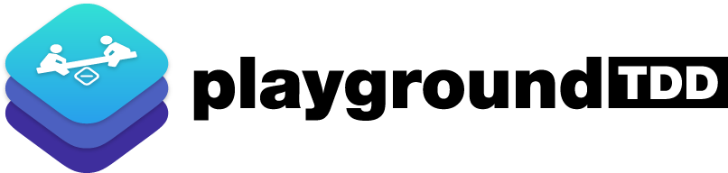
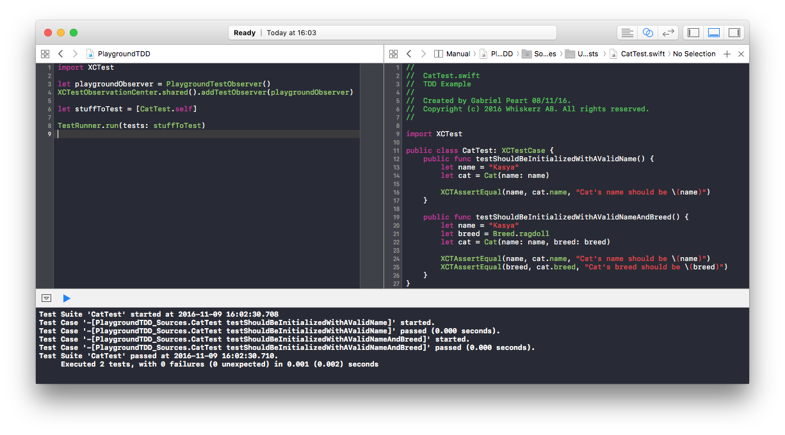

[]
(https://developer.apple.com/swift/)

**PlaygroundTDD** enables you to use *TDD* directly on *Xcode Playground* during your development process.
If your development workflow is based on *Playground*, sure you will save a huge amount of time by using our helper!

## Build Status
|**Branch**| **Status** |
|---|---|
|**master** ||
|**develop** ||

##  Author
[Gabriel Peart](http://github.com/gabrielPeart)  

## Main Contributors
Logo design by [Chris Scholly](https://github.com/chrisscholly) 

## License
PlaygroundTDD is released under the MIT license.  
See LICENSE for details.
